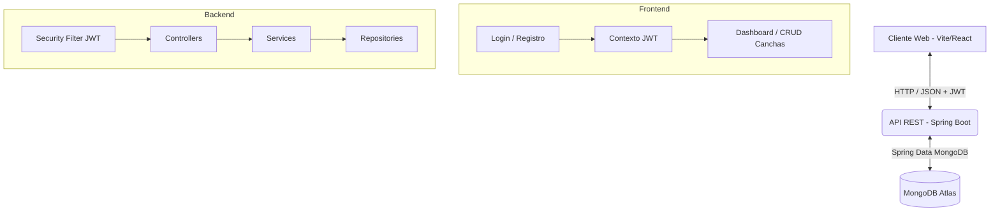

# FutReserve ⚽

Plataforma FullStack para el alquiler y gestión de canchas sintéticas.

## Tecnologías Utilizadas

*   **Backend:** Spring Boot 3, Spring Security, JWT, Java 17, Maven.
*   **Base de Datos:** MongoDB Atlas (NoSQL en la nube).
*   **Frontend:** React, Vite, Axios, React Router.
*   **Diseño:** CSS global (Tema oscuro con detalles verde neón).

## Estructura del Proyecto

El proyecto está dividido en dos carpetas principales en la raíz:

*   `/backend`: Contiene la API REST desarrollada en Spring Boot.
*   `/frontend`: Contiene la aplicación web desarrollada con Vite + React.

## Cómo ejecutar el proyecto localmente

### 1. Ejecutar el Backend (Spring Boot)

Asegúrate de tener instalado Java 17+ y Maven.
La conexión a MongoDB Atlas ya está configurada en `backend/src/main/resources/application.properties`.

1.  Abre una terminal.
2.  Navega a la carpeta del backend:
    ```bash
    cd backend
    ```
3.  Ejecuta la aplicación usando Maven:
    ```bash
    mvn spring-boot:run
    ```
    El servidor backend se iniciará en `http://localhost:8080`.

### 2. Ejecutar el Frontend (Vite + React)

Asegúrate de tener instalado Node.js (v18 o superior).

1.  Abre **otra** terminal nueva.
2.  Navega a la carpeta del frontend:
    ```bash
    cd frontend
    ```
3.  Instala las dependencias (si no lo has hecho ya):
    ```bash
    npm install
    ```
4.  Inicia el servidor de desarrollo:
    ```bash
    npm run dev
    ```
    El frontend estará disponible en `http://localhost:5173`.

### 3. Evitar subir archivos temporales o compilados
Asegúrense de no modificar ni borrar los archivos `.gitignore`. Estos previenen que se suban a GitHub archivos basura generados por sus computadoras o IDEs (como las carpetas `target/`, `node_modules/` o configuraciones de VS Code / IntelliJ).

## Funcionalidades Implementadas

*   **Autenticación:** Registro e inicio de sesión de usuarios usando JWT.
*   **Protección de Rutas:** El frontend utiliza Private Routes para asegurar que solo usuarios logueados accedan al dashboard y a la gestión de canchas.
*   **CRUD de Canchas:** Crear, listar, actualizar y eliminar canchas sintéticas (exclusivo para usuarios autenticados).

## Arquitectura



---


