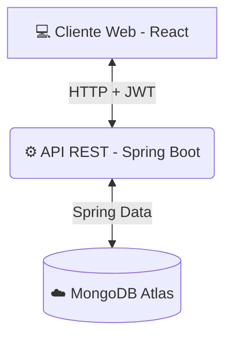

# ⚽ FutReserve

> **Plataforma FullStack para el alquiler y gestión rápida de canchas sintéticas.**

---

## 🌟 ¿Qué es FutReserve?

**FutReserve** es tu aliado perfecto para la administración de canchas de fútbol. 

* ⚽ **Explora** nuestro catálogo de canchas.
* 🔒 **Regístrate** e inicia sesión de forma segura.
* 📅 **Gestiona** tus reservas desde un panel rápido e intuitivo.

---

## 👥 Integrantes del Equipo

*   👨‍💻 **David Esteban Suarez Lozano**
*   👨‍💻 **Thomas Alejandro Perez Rojas**
*   👨‍💻 **Jesus David Santodomingo Carrascal**

---
  
## 🛠️ Tecnologías Principales

Un stack moderno, potente y seguro:

*   ⚙️ **Backend:** Spring Boot 3 + Java 17 | Seguridad con JWT
*   ☁️ **Base de Datos:** MongoDB Atlas (NoSQL en la nube)
*   💻 **Frontend:** React + Vite (Rendimiento ultrarrápido)
*   🎨 **Diseño:** Tema oscuro premium con contrastes en **verde neón**.

---

## 🚀 Funcionalidades Clave

*   ✔️ **Seguridad Total:** Autenticación protegida con tokens JWT.
*   ✔️ **Gestión de Canchas:** Administra (CRUD) todas las canchas disponibles.
*   ✔️ **Reservas Fáciles:** Agenda partidos en fechas específicas rápidamente.
*   ✔️ **Dashboard Central:** Todo bajo control en una sola vista estructurada.
*   ✔️ **Privacidad:** Rutas privadas para garantizar accesos seguros.

---

## 🏗️ Arquitectura del Sistema

El sistema separa claramente el frontend y el backend para máxima escalabilidad:

### 🔄 Flujo de Trabajo:
1. **Acceso:** El usuario interactúa con la interfaz web.
2. **Token:** El backend valida credenciales y emite un token **JWT**.
3. **Peticiones:** El frontend incluye el JWT para acceder a zonas protegidas.
4. **Persistencia:** La información se sincroniza en **MongoDB Atlas**.

---

