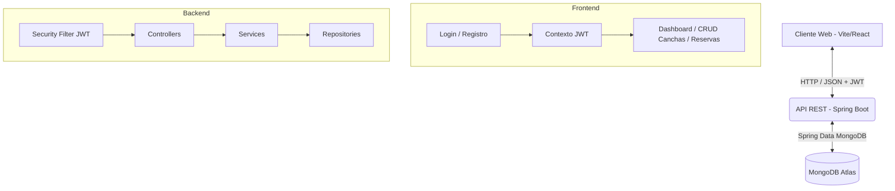

# FutReserve ⚽

Plataforma FullStack para el alquiler y gestión de canchas sintéticas.

## ¿Qué es FutReserve?

FutReserve es un sistema integral diseñado para facilitar la reserva y administración de canchas de fútbol sintéticas. Permite a los usuarios registrarse, iniciar sesión de forma segura y visualizar un catálogo de canchas disponibles, además de gestionar reservas de manera rápida y eficiente a través de un panel de control (Dashboard).

## Tecnologías Utilizadas

El proyecto fue construido utilizando un enfoque FullStack moderno, dividiendo las responsabilidades entre el frontend y el backend:

*   **Backend (API REST):** Desarrollado con Spring Boot 3 y Java 17. Utiliza Spring Security y JSON Web Tokens (JWT) para la autenticación y autorización segura. El manejo de dependencias se realiza mediante Maven.
*   **Base de Datos:** MongoDB Atlas. Una base de datos NoSQL alojada en la nube que ofrece alta disponibilidad y flexibilidad para los datos de usuarios, canchas y reservas.
*   **Frontend (Interfaz de Usuario):** Construido con React y Vite para un rendimiento ultrarrápido. Utiliza React Router para la navegación entre páginas y Axios para consumir la API REST del backend.
*   **Diseño y UI:** Se empleó CSS global con un diseño centrado en la usabilidad, presentando un tema oscuro moderno con detalles y contrastes en verde neón para una estética deportiva premium.

## ¿Cómo funciona?

La arquitectura del sistema está basada en una separación de capas clara:

1.  **Interacción del Usuario:** El cliente interactúa con la interfaz web desarrollada en React.
2.  **Autenticación:** Al iniciar sesión o registrarse, el frontend envía las credenciales al backend, el cual las valida y genera un token JWT firmado.
3.  **Autorización y Peticiones:** El frontend almacena este token JWT de forma segura y lo incluye en la cabecera `Authorization` de todas las peticiones subsecuentes a rutas protegidas (como crear una reserva o ver el dashboard).
4.  **Lógica de Negocio (Backend):** El servidor Spring Boot recibe las peticiones, intercepta los tokens mediante filtros de seguridad, valida que el usuario tenga los permisos necesarios y procesa la lógica de reservas, consulta de canchas y gestión de usuarios.
5.  **Persistencia de Datos:** Todos los datos y transacciones se guardan asíncronamente en MongoDB Atlas a través de repositorios de Spring Data.

## Funcionalidades Principales

*   **Autenticación Segura:** Registro e inicio de sesión de usuarios usando JWT.
*   **Gestión de Canchas:** Crear, leer, actualizar y eliminar (CRUD) información de las canchas disponibles.
*   **Sistema de Reservas:** Los usuarios pueden reservar canchas en fechas específicas y revisar su historial.
*   **Dashboard Interactivo:** Un panel central de control que proporciona acceso rápido a las funciones clave de la plataforma.
*   **Protección de Rutas:** El frontend protege activamente las vistas privadas para asegurar que solo usuarios verificados accedan a la gestión.
